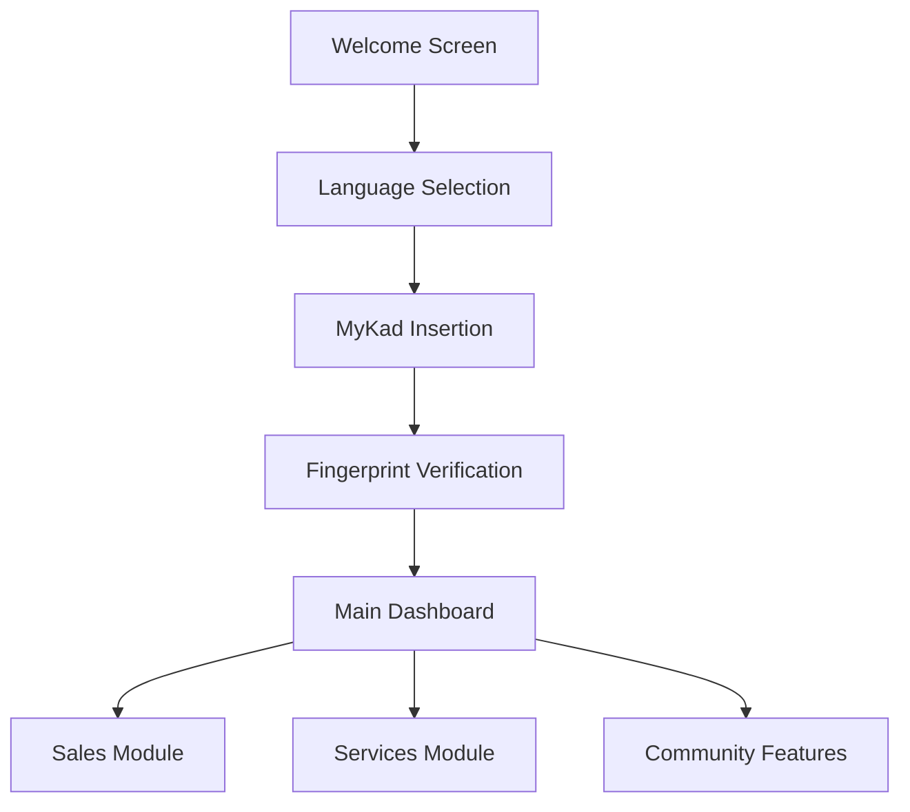
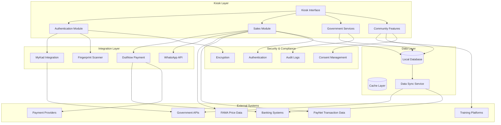
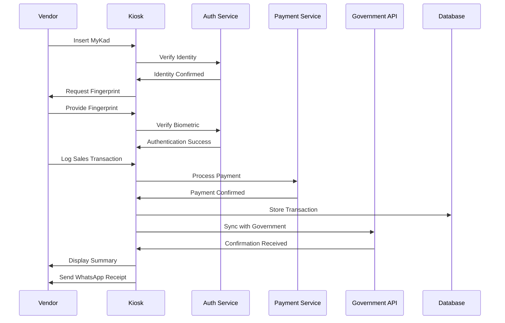

# 🏪 VendorBridge Kiosk Prototype

> **A human-assisted digital kiosk solution for Malaysian wet market vendors to access government financial assistance, microloans, current market ceiling prices, and community resources**

[](https://nextjs.org/)
[](https://www.typescriptlang.org/)
[](https://tailwindcss.com/)

## 📑 Table of Contents

- [🎯 Problem Statement](#-problem-statement)
- [🏛️ Institutional Context](#️-institutional-context)
- [🎯 Solution Overview](#-solution-overview)
  - [👥 User Personas](#-user-personas)
  - [🏗️ System Components](#️-system-components)
  - [🌟 Key Features](#-key-features)
- [📊 Impact & Transformation](#-impact--transformation)
- [🚀 How It Works](#-how-it-works)
  - [User Journey Flow](#user-journey-flow)
  - [Core Components](#core-components)
- [🏗️ Software Architecture](#️-software-architecture)
  - [System Architecture Diagram](#system-architecture-diagram)
  - [Component Architecture](#component-architecture)
  - [Data Flow Architecture](#data-flow-architecture)
- [⚖️ Design Trade-offs & Technical Decisions](#️-design-trade-offs--technical-decisions)
  - [Technology Choices](#technology-choices)
  - [Architectural Limitations](#architectural-limitations)
  - [Scalability Considerations](#scalability-considerations)
- [🛠️ Setup Instructions](#️-setup-instructions)
  - [Prerequisites](#prerequisites)
  - [Installation](#installation)
  - [Available Scripts](#available-scripts)
- [🎨 Technology Stack](#-technology-stack)
- [📱 Kiosk Interface Design](#-kiosk-interface-design)
- [🔧 Customization](#-customization)
- [🌐 Deployment](#-deployment)
- [📊 Performance & Optimization](#-performance--optimization)
- [💰 Funding & Partnerships](#-funding--partnerships)
- [🤝 Contributing](#-contributing)
- [📄 License](#-license)
- [🆘 Support](#-support)
- [🤖 AI Development Disclosure](#-ai-development-disclosure)

## 🎯 Problem Statement

Southeast Asia heavily relies on the informal economy, particularly market sales like "pasar pagi" in Malaysia, "talad sod" in Thailand, and "palengke" in the Philippines. Despite government efforts to digitize financial ecosystems, current systems exclude low digital literacy communities. Training programs like Go Digital ASEAN show only 19% confidence in ICT tools before training.

**Key Challenges:**
- **Digital Exclusion**: Micro-entrepreneurs lack formal education and digital exposure
- **Financial Disconnect**: Vendors miss available incentives due to unawareness or access barriers
- **Data Blindness**: Government lacks real-time market intelligence for policy decisions
- **Informal Practices**: Handwritten logbooks and unofficial lending continue to dominate

## 🏛️ Institutional Context

### Current Ecosystem
- **Municipal Councils**: Direct vendor contact but limited digital infrastructure
- **PayNet Malaysia**: DuitNow QR infrastructure with data privacy constraints
- **Government Initiatives**: MyDIGITAL Blueprint and Smart City Framework create integration opportunities
- **Previous Attempts**: Pusat Internet Komuniti provided access but lacked human support

### Policy Alignment
VendorBridge supports national strategies by offering ground-level solutions that link vendors to digital tools through organized, human-assisted procedures connecting local councils, payment providers, and federal agencies.

## 🎯 Solution Overview

VendorBridge establishes a reliable, human-assisted interface between market vendors and the digital economy, reshaping visibility, risk flows, and resource allocation by embedding kiosks within traditional market environments.

### 👥 User Personas

**Senior Fishmonger (Kelantan)**
- Relied on handwritten ledgers
- Now uses VendorBridge kiosk with youth agent assistance
- Sends WhatsApp payment receipts to digital account
- Eligible for state fishery subsidies and microloans

**Young Kuih Vendor (Johor Bahru)**
- Young mother running a kuih stall
- Receives system suggestions for free baking workshops
- Gets alerts about rising ingredient costs
- Guided through simplified tax/SST registration
- Connects to small-business grants

### 🏗️ System Components

**Kiosk Hubs with Youth Agents**
- Market kiosks staffed by trained youth (MDEC's eUsahawan graduates)
- Trusted local interface for vendors
- Malaysia's MADANI kiosks offer 90+ integrated services

**Identity & Payment Integration**
- MyKad-verified identity for every vendor
- Sales logged via Malaysia's DuitNow payment rails
- Trusted ID system for each transaction

**Privacy & Consent**
- Complies with Malaysia's data protection rules
- Requires explicit vendor consent before data sharing
- Built-in consent framework for future services

**Human-Centric Onboarding**
- Face-to-face training and ongoing support
- Hands-on demos for vendor security
- Trust-driven adoption rather than technology-only approach

### 🌟 Key Features

- **🔐 Secure Authentication**: MyKad integration with fingerprint verification
- **🌐 Multilingual Support**: English and Bahasa Malaysia interface
- **📊 Sales Management**: Track daily sales and generate reports with WhatsApp integration and AI-powered logbook scanning
- **🏛️ Government Services**: Direct access to official services and applications
- **💰 Financial Aid Services**: Comprehensive financial assistance, subsidies, and microloan applications
- **📈 Market Intelligence**: Price alerts and market trend updates
- **👥 Community Features**: Training programs and vendor community updates
- **📱 WhatsApp Reporting**: Automated sales report generation and sharing via WhatsApp
- **🤖 AI Logbook Scanning**: Camera-based handwritten logbook digitization with intelligent text extraction
- **🎨 Modern Kiosk Interface**: Touch-optimized UI with prominent icons and intuitive navigation

## 📡 Data Sources & Integration

### Real-time Market Data
VendorBridge integrates with official Malaysian government data sources to provide accurate, up-to-date market intelligence:

#### **FAMA Price Data Integration**
- **Source**: [Federal Agricultural Marketing Authority (FAMA)](https://www.fama.gov.my/harga-pasaran-terkini)
- **Update Frequency**: Every 5 minutes
- **Commodities Tracked**:
  - Bawang Besar Merah (Import) - Large Red Onions
  - Bayam - Spinach
  - Cili Merah (Thailand) - Thai Red Chilies
  - Daun Bawang - Spring Onions
  - Kacang Bendi - Lady Fingers/Okra
  - Timun Hijau - Green Cucumber
- **Data Points**: Current prices, price changes, trend analysis, unit measurements
- **Reliability**: Fallback system with cached data for continuous service

#### **Government Services Integration**
- **MyKad Authentication**: National identity card verification system
- **DuitNow Payment Rails**: Malaysia's national payment infrastructure
- **PayNet Transaction Data**: Real-time payment and transaction analytics
- **SSM Business Registration**: Companies Commission of Malaysia data
- **LHDN Tax Services**: Inland Revenue Board integration
- **CTOS Credit Scoring**: Credit reporting services
- **EPF & SOCSO**: Employee benefits and social security systems

#### **Data Processing & Privacy**
- **Real-time Processing**: Live data fetching with automatic refresh cycles
- **Error Handling**: Graceful degradation with fallback mechanisms
- **Data Privacy**: GDPR-compliant handling with explicit user consent
- **Audit Trails**: Comprehensive logging for regulatory compliance
- **Local Caching**: Offline capability with synchronized updates

#### **API Architecture**
```
FAMA Website → VendorBridge API → Custom Hook → UI Components
     ↓              ↓                ↓            ↓
Live Prices → Data Processing → State Management → User Display

PayNet APIs → Transaction Service → Analytics Engine → Dashboard
     ↓              ↓                    ↓              ↓
Payment Data → Real-time Processing → Business Insights → Vendor Reports

Camera Input → AI OCR Service → Data Parser → Sales Dashboard
     ↓              ↓              ↓            ↓
Logbook Photo → Text Extraction → Transaction Data → Live Updates
```

### Data Benefits for Vendors
- **Informed Purchasing**: Real-time price trends for better buying decisions
- **Pricing Strategy**: Market intelligence for competitive pricing
- **Cost Management**: Track ingredient cost fluctuations
- **Seasonal Planning**: Historical data patterns for menu planning
- **Risk Mitigation**: Early warning system for price volatility
- **Transaction Analytics**: PayNet data provides sales insights and payment trends
- **Financial Planning**: Real-time revenue tracking and cash flow analysis
- **Customer Behavior**: Payment pattern analysis for business optimization
- **Instant Reporting**: WhatsApp integration for immediate sales report sharing
- **Mobile Accessibility**: Receive detailed reports directly on mobile devices
- **Digital Transformation**: Convert handwritten logbooks to digital data instantly
- **Accuracy Enhancement**: AI-powered text recognition for precise transaction extraction

## 🤖 AI-Powered Logbook Scanning

### Intelligent Document Processing
VendorBridge revolutionizes traditional record-keeping by converting handwritten logbooks into digital data through advanced AI technology.

#### **📸 Camera Integration**
- **Live Camera Access**: Direct access to device camera with optimized settings for document capture
- **Mobile-First Design**: Back-facing camera preference for mobile devices with high-resolution capture (1920x1080)
- **Visual Guidance**: On-screen frame overlay to guide optimal logbook positioning
- **Fallback Options**: File upload alternative for devices without camera access

#### **🧠 AI Text Extraction**
- **Handwriting Recognition**: Advanced OCR technology for Malaysian handwritten text
- **Context-Aware Processing**: Understands Malaysian currency format (RM) and local transaction patterns
- **Transaction Parsing**: Intelligent extraction of time, payment type, amounts, and item descriptions
- **Data Validation**: Ensures extracted data integrity and accuracy

#### **📊 Real-Time Dashboard Updates**
- **Additive Processing**: New logbook entries add to existing sales data without overwriting
- **Live Statistics**: Instant updates to total sales, cash/QR transaction counts, and amounts
- **Transaction History**: Newly extracted transactions appear in recent activity feed
- **Visual Feedback**: Processing states and success confirmations for user confidence

#### **🎯 User Experience Flow**
1. **📱 Navigate to Sales → Transaction Logging**
2. **📸 Click "Upload Logbook Photo"** → Camera interface opens
3. **🎯 Position logbook page** within visual frame guide
4. **📷 Capture or upload** logbook image
5. **🤖 AI Processing** → 2-4 second intelligent text extraction
6. **✅ Data Integration** → Transactions parsed and validated
7. **📊 Dashboard Update** → All sales metrics refresh automatically
8. **🎉 Confirmation** → Success indicator with "Logbook Processed" status

#### **🔧 Technical Implementation**
```javascript
// Camera API Integration
navigator.mediaDevices.getUserMedia({
  video: {
    facingMode: 'environment', // Back camera for mobile
    width: { ideal: 1920 },
    height: { ideal: 1080 }
  }
})

// AI Processing Pipeline
const result = await processLogbookImage(imageData)
if (result.success) {
  updateSalesDashboard(result.data)
}
```

#### **🚀 Production-Ready Architecture**
The current implementation provides a complete working prototype. For production deployment, the system can integrate with:
- **Google Cloud Vision API** for enterprise-grade OCR
- **OpenAI GPT-4 Vision** for intelligent document understanding
- **Custom ML Models** trained specifically on Malaysian logbook formats
- **Tesseract.js** for client-side processing and offline capability

#### **📈 Business Impact**
- **Time Savings**: Eliminates manual data entry, reducing administrative overhead
- **Accuracy Improvement**: Reduces human error in transaction recording
- **Digital Transformation**: Bridges traditional paper-based systems with modern digital tools
- **Accessibility**: Enables vendors with limited digital literacy to adopt digital record-keeping
- **Compliance**: Creates digital audit trails for regulatory and financial requirements

## 📊 Impact & Transformation

### Data Visibility Revolution
- **Real-time Market Intelligence**: Captures digital sales records at point of sale
- **Policy Feedback Loop**: Seasonal demand shifts, price fluctuations, and income trends
- **Evidence-based Interventions**: Timely data for ceiling prices, resource allocation, and targeted subsidies

### Inclusive Resource Allocation
- **Digital Footprint Creation**: Vendors with no previous digital history gain access to services
- **Targeted Assistance**: Better-targeted subsidies and microloans for previously excluded vendors
- **Trust-driven Adoption**: Behavior change through human facilitators, not technology alone

### Scalable Design
- **Youth Employment Integration**: Reduces outreach costs while creating local jobs
- **System Integration**: Syncs with existing MyKad and DuitNow infrastructure
- **Future-ready**: Consent framework supports training, disaster aid, and insurance services

## 🚀 How It Works

### User Journey Flow



### Core Components

1. **Welcome Screen**: Bilingual introduction with authentic Malaysian market background imagery
2. **Authentication Flow**: MyKad card insertion with visual guidance → Fingerprint verification
3. **Main Dashboard**: Central hub with prominent icon-based navigation and touch-optimized interface
4. **Sales Module**: Daily sales tracking and reporting with visual analytics, WhatsApp integration, and AI-powered logbook scanning
5. **Financial Aid Module**: Comprehensive application profile, eligible subsidies, and featured loan programs
6. **Government Services**: Direct access to official services and applications
7. **Community Module**: Training programs, updates, and vendor networking

## 🏗️ Software Architecture

### System Architecture Diagram



### Component Architecture

**Frontend Layer (React/Next.js)**
- **Kiosk Interface**: Touch-optimized UI components
- **State Management**: React Context for global state
- **Routing**: Next.js App Router for navigation
- **Styling**: Tailwind CSS for responsive design

**Integration Layer**
- **MyKad Reader**: Hardware integration for identity verification
- **Fingerprint Scanner**: Biometric authentication
- **Payment Gateway**: DuitNow QR integration
- **Communication**: WhatsApp API for notifications and sales reporting
- **FAMA Data Service**: Real-time market price integration
- **PayNet Transaction Analytics**: Real-time payment data and transaction insights
- **Government APIs**: SSM, LHDN, CTOS, EPF/SOCSO integration

**Data Layer**
- **Local Storage**: SQLite for offline capability
- **Cache Management**: Redis for session data
- **Sync Service**: Background data synchronization
- **Backup**: Automated local backup system

**Security Layer**
- **Encryption**: AES-256 for data at rest
- **Authentication**: Multi-factor authentication flow
- **Audit Trail**: Comprehensive logging system
- **Consent Management**: GDPR-compliant data handling

### Data Flow Architecture



## ⚖️ Design Trade-offs & Technical Decisions

### Technology Choices

**Next.js 14 with App Router**
- **Rationale**: Server-side rendering for better performance in low-connectivity environments
- **Trade-off**: Larger bundle size vs. improved SEO and initial load times
- **Use Case Fit**: Kiosks need fast initial loads and offline capability

**SQLite for Local Storage**
- **Rationale**: Zero-configuration database perfect for kiosk environments
- **Trade-off**: Limited concurrent users vs. simplicity and reliability
- **Use Case Fit**: Single-user kiosk interface doesn't require complex database management

**React Context over Redux**
- **Rationale**: Simpler state management for kiosk use case
- **Trade-off**: Less sophisticated state management vs. reduced complexity
- **Use Case Fit**: Kiosk applications have predictable state flows

**Tailwind CSS over Custom CSS**
- **Rationale**: Rapid development and consistent design system
- **Trade-off**: Larger CSS bundle vs. faster development and maintenance
- **Use Case Fit**: Kiosk interfaces need consistent, accessible design patterns

### Architectural Limitations

**Offline-First Design Constraints**
- **Limitation**: Limited real-time data synchronization
- **Mitigation**: Background sync when connectivity available
- **Impact**: Some features may have delayed updates

**Single-User Architecture**
- **Limitation**: Not designed for concurrent multi-user access
- **Mitigation**: Each kiosk serves one vendor at a time
- **Impact**: Scalability requires multiple kiosk units

**Hardware Dependencies**
- **Limitation**: Requires specific hardware (MyKad reader, fingerprint scanner)
- **Mitigation**: Modular design allows hardware upgrades
- **Impact**: Deployment complexity and hardware costs

**Data Privacy Compliance**
- **Limitation**: Complex consent management and data handling
- **Mitigation**: Built-in consent framework and audit trails
- **Impact**: Development complexity but essential for compliance

### Scalability Considerations

**Horizontal Scaling**
- **Strategy**: Deploy multiple kiosk units across markets
- **Implementation**: Centralized management dashboard
- **Limitation**: Each kiosk operates independently

**Data Synchronization**
- **Strategy**: Batch synchronization during off-peak hours
- **Implementation**: Queue-based sync service
- **Limitation**: Real-time data not guaranteed

**Performance Optimization**
- **Strategy**: Code splitting and lazy loading
- **Implementation**: Next.js automatic optimization
- **Limitation**: Initial bundle size may be large

**Security Scaling**
- **Strategy**: Centralized authentication and audit logging
- **Implementation**: JWT tokens and centralized logging
- **Limitation**: Network dependency for authentication

### Why These Choices Fit the Use Case

**Kiosk-Specific Requirements**
- **Touch Interface**: React components optimized for touch interaction
- **Offline Capability**: SQLite ensures functionality without internet
- **Security**: Multi-factor authentication essential for financial transactions
- **Accessibility**: Tailwind CSS provides consistent, accessible design patterns

**Malaysian Market Context**
- **MyKad Integration**: Essential for Malaysian identity verification
- **DuitNow Payment**: Leverages existing Malaysian payment infrastructure
- **WhatsApp Integration**: Most popular communication platform in Malaysia
- **Multilingual Support**: English and Bahasa Malaysia for diverse users

**Government Integration**
- **API-First Design**: Easy integration with government services
- **Audit Compliance**: Comprehensive logging for regulatory compliance
- **Data Privacy**: GDPR-compliant data handling for international standards
- **Scalable Architecture**: Can expand to other Southeast Asian markets

## 🛠️ Setup Instructions

### Prerequisites

- **Node.js** (v18 or higher)
- **npm** or **yarn** package manager
- Modern web browser (Chrome, Firefox, Safari, Edge)

### Installation

1. **Clone the repository**
   ```bash
   git clone <repository-url>
   cd vendorbridge-prototype
   ```

2. **Install dependencies**
   ```bash
   npm install
   # or
   yarn install
   ```

3. **Start the development server**
   ```bash
   npm run dev
   # or
   yarn dev
   ```

4. **Open your browser**
   Navigate to [http://localhost:3000](http://localhost:3000)

### Available Scripts

```bash
npm run dev      # Start development server
npm run build    # Build for production
npm run start    # Start production server
npm run lint     # Run ESLint
```

## 🎨 Technology Stack

### Frontend
- **Next.js 14.2.16** - React framework with App Router
- **TypeScript** - Type-safe JavaScript
- **Tailwind CSS** - Utility-first CSS framework
- **Radix UI** - Accessible component primitives
- **Lucide React** - Beautiful icon library

### Data Integration
- **FAMA API Integration** - Real-time market price data
- **Custom React Hooks** - Data fetching and state management
- **Automatic Refresh** - 5-minute update cycles
- **Error Handling** - Graceful fallback mechanisms
- **Data Caching** - Offline capability with sync

### AI & Computer Vision
- **Camera API Integration** - Native device camera access with MediaDevices API
- **AI Text Extraction** - Intelligent OCR processing for handwritten logbooks
- **Image Processing** - High-resolution capture and optimization
- **Real-time Processing** - Live document scanning with visual feedback
- **Data Parsing** - Context-aware transaction extraction and validation

### UI Components
- **shadcn/ui** - Reusable component library
- **Custom Components** - Tailored for kiosk interface
- **Responsive Design** - Touch-optimized for kiosk displays

### Development Tools
- **ESLint** - Code linting
- **PostCSS** - CSS processing
- **Hot Reload** - Instant development feedback

## 📱 Kiosk Interface Design

### Design Principles
- **Touch-First**: Large buttons and intuitive gestures
- **Accessibility**: High contrast, clear typography
- **Multilingual**: Seamless language switching
- **Offline-Ready**: Core functionality without internet dependency
- **Icon-Centric Navigation**: Prominent visual icons for easy recognition
- **Consistent Alignment**: Uniform button heights and spacing

### Visual Identity
- **Color Scheme**: Professional blue and white palette with accent colors
- **Typography**: Clear, readable fonts optimized for screens
- **Imagery**: Authentic Malaysian market scenes and vendor-focused photography
- **Branding**: VendorBridge logo with handshake symbolism
- **Icon Design**: Custom iconography for each service module
- **Layout**: Grid-based design with prominent icon placement above text buttons

### Interface Enhancements
- **Prominent Icons**: 120x120px icons positioned above text buttons for better visual hierarchy
- **Compact Buttons**: Optimized button sizing (h-16) for efficient screen space usage
- **Visual Guidance**: MyKad insertion guidance with actual card imagery
- **Financial Aid Dashboard**: Comprehensive application profile with institutional logos (SSM, CTOS, LHDN, Maybank)
- **Scrollable Content**: Vertical scrolling for eligible subsidies, horizontal scrolling for featured programs
- **Non-scrollable Pages**: Fixed viewport design ensuring all content fits on single screen
- **WhatsApp Integration**: One-click sales report generation with comprehensive daily and weekly analytics
- **AI Logbook Digitization**: Camera-based scanning with intelligent handwriting recognition and transaction parsing

## 🔧 Customization

### Adding New Services
1. Create new component in `/components/`
2. Add route in main app navigation
3. Update language context for translations
4. Style with Tailwind CSS classes

### Modifying Authentication
- Update MyKad integration in `/components/mykad-prompt.tsx`
- Modify fingerprint verification in `/components/fingerprint-login.tsx`
- Adjust security settings as needed

### Styling Changes
- Modify global styles in `/app/globals.css`
- Update component styles in individual `.tsx` files
- Customize Tailwind configuration in `tailwind.config.js`

## 🌐 Deployment

### Production Build
```bash
npm run build
npm run start
```

### Environment Variables
Create a `.env.local` file for production configuration:
```env
NEXT_PUBLIC_API_URL=your_api_endpoint
NEXT_PUBLIC_ENVIRONMENT=production
```

## 📊 Performance & Optimization

- **Image Optimization**: Next.js automatic image optimization
- **Code Splitting**: Automatic route-based code splitting
- **Bundle Analysis**: Built-in bundle analyzer
- **Caching**: Optimized caching strategies

## 💰 Partnerships

### Strategic Funders
- **Bank Negara Malaysia**: Financial Sector Blueprint 2022–2026 digital inclusion mandate
- **MDEC**: Malaysia Digital Sandbox program for underserved communities
- **Khazanah Nasional**: Dana Impak for youth-led inequality solutions
- **Regional Partners**: ASEAN Digital Integration Framework and UNCDF

### Post-Hackathon Strategy
1. **Letter of Intent**: Secure commitment from city council
2. **Sandbox Entry**: Apply via MDEC or Bank Negara
3. **Public Pilot**: Launch to validate real-world impact
4. **Institutional Support**: Leverage Universiti Malaya and smart city initiatives

### Measurable Impact
- Number of vendors onboarded
- Volume of digital sales logs generated
- Uptake of subsidies and microloans
- First-time access to digital financial services

## 🤝 Contributing

1. Fork the repository
2. Create a feature branch (`git checkout -b feature/amazing-feature`)
3. Commit your changes (`git commit -m 'Add amazing feature'`)
4. Push to the branch (`git push origin feature/amazing-feature`)
5. Open a Pull Request

## 📄 License

This project is licensed under the MIT License - see the [LICENSE](LICENSE) file for details.

## 🆘 Support

For support and questions:
- Create an issue in the repository
- Contact the development team
- Check the documentation wiki

---

## 🤖 AI Development Disclosure

This prototype was developed with the assistance of AI tools to accelerate the development process and ensure best practices:

### AI Tools Used
- **Claude Sonnet 4** - Code generation, debugging, and architectural guidance
- **AI-powered design tools** - Logo optimization and background removal

### AI Contributions
- **Code Structure**: AI-assisted component architecture and TypeScript implementation
- **UI Components**: Automated generation of accessible, responsive components
- **Documentation**: AI-generated comprehensive README and code comments
- **Optimization**: Performance suggestions and best practice implementations
- **UI/UX Enhancements**: Icon placement optimization, layout improvements, and responsive design
- **Internationalization**: Translation key management and bilingual content support
- **Visual Design**: Image optimization, background removal, and layout refinements

### Human Oversight
- **Design Decisions**: All design choices and user experience decisions made by human developers
- **Code Review**: All AI-generated code reviewed and validated by human developers
- **Testing**: Manual testing and quality assurance performed by human team
- **Business Logic**: Core business requirements and logic defined by human stakeholders

### Transparency Commitment
We believe in transparent development practices. While AI tools accelerated our development process, all final decisions, designs, and implementations were guided by human expertise and domain knowledge.

---

**Built with ❤️ by team SEAgma for Malaysian market vendors**

*Empowering local businesses through technology*

*APRU Tech Policy Hackathon 2025*

